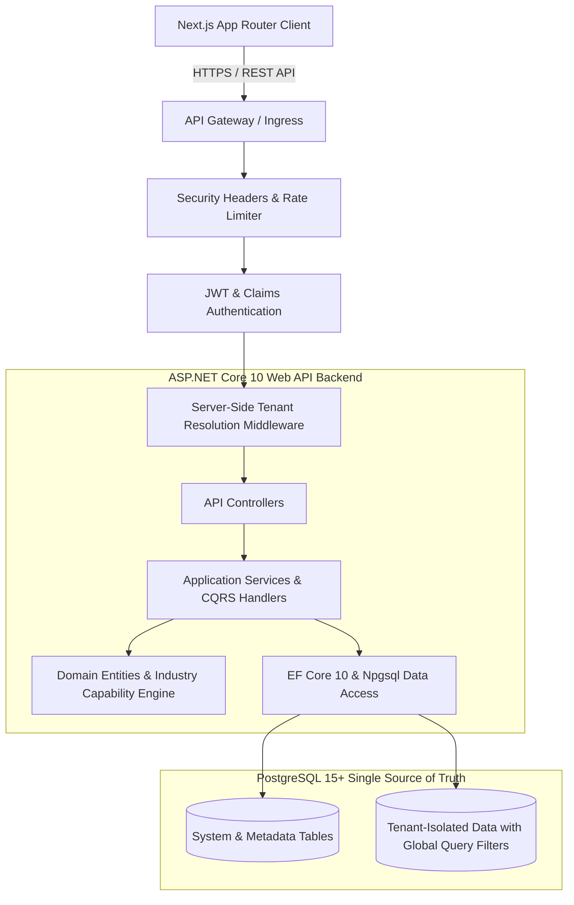

# 01. System Architecture Specification

## 1. Executive Summary

The **UdyogBill Multi-Industry SaaS Platform** is a scalable, cloud-native enterprise business management, billing, inventory, and compliance system. It is engineered with a **Two-Level Multi-Tenant Architecture**:

1. **Level 1 — Super Admin (Platform Owner)**: Global management of tenants, dynamic industry templates, modules, features, pricing plans, subscription lifecycle, usage limits, platform health, audit logs, and global reporting.
2. **Level 2 — Subscriber / Tenant**: Independent business operations tailored specifically to the tenant's chosen industry (e.g., Pharma, FMCG, Garments, Hardware, Bakery, Retail, Wholesale), with strict data isolation, configurable workflows, RBAC, branch/warehouse isolation, and transaction management.

---

## 2. Core Architectural Principles

- **Clean & Modular Architecture**: Clear separation of concerns between `Domain`, `Application`, `Infrastructure`, `Persistence`, and `Api`.
- **Common Core + Industry Capability Layer**: A single, unified codebase powers all 14+ industries through metadata-driven capability layers rather than separate siloed codebases.
- **Server-Side Trust Boundary**: All tenant identification, role resolution, and feature entitlements are resolved strictly from authenticated server-side context (claims/session tokens). Client-supplied `TenantId` parameters are never trusted for tenant-scoped operations.
- **Fail-Safe Tenant Isolation**: Database access incorporates mandatory EF Core global query filters and interceptors that guarantee tenant separation at the query and command levels.
- **Extensible Feature Hierarchy**: Built upon a 6-level capability hierarchy: `Industry` -> `Module` -> `Feature` -> `SubFeature` -> `Permission` -> `Plan Entitlement`.

---

## 3. Technology Stack Specification

| Component | Technology | Rationale |
| :--- | :--- | :--- |
| **Backend Runtime** | .NET 10 (C# 14 / C# 13) | Enterprise performance, native AOT compatibility, memory efficiency, asynchronous scalability. |
| **Web API Framework** | ASP.NET Core 10 Web API | High-throughput Kestrel server, dependency injection, robust middleware pipeline, OpenAPI 3.0 / Swagger. |
| **ORM / Data Access** | Entity Framework Core 10 (Npgsql) | Strongly-typed LINQ queries, migration management, global query filters, interceptors, JSONB mapping. |
| **Database** | PostgreSQL 15+ | Open-source relational standard, ACID transactions, row-level security, composite indexing, JSONB column support for industry-specific schema extensions. |
| **Frontend Framework** | Next.js 15+ (App Router) | Server-Side Rendering (SSR), React Server Components, edge routing, performance optimization. |
| **Frontend UI / Styling** | React 19 / TypeScript / Tailwind CSS | Type-safe UI components, maintainable design system, responsive layouts. |
| **State & API Communication**| Axios / Fetch / React Query | RESTful HTTP communication with Bearer authentication and request interceptors. |
| **Testing** | xUnit, FluentAssertions, Moq | Unit, integration, and architecture constraint verification. |

---

## 4. Layered Architecture Breakdown

### 4.1 Backend Structure (`/backend/src`)

1. **`UdyogBill.Domain`**:
   - Contains pure business logic, domain entities, value objects, domain events, domain exceptions, and entity interfaces (`ITenantScopedEntity`, `ISoftDeletable`, `IAuditableEntity`).
   - Has **zero** external library dependencies (pure C#).
2. **`UdyogBill.Application`**:
   - Houses application service interfaces, CQRS command/query models, DTOs, business validators, and result wrappers (`Result<T>`).
   - Depends only on `UdyogBill.Domain` and `UdyogBill.Shared`.
3. **`UdyogBill.Infrastructure`**:
   - Implements cross-cutting concerns: JWT token generation, secure password hashing (PBKDF2 / Argon2 / BCrypt), current user context provider, server-side tenant resolver, email/SMS stubs, audit logging services.
4. **`UdyogBill.Persistence`**:
   - Implements `AppDbContext`, EF Core fluent configurations, database migrations, connection factory, `AuditableEntitySaveChangesInterceptor`, and tenant-filtering interceptors.
5. **`UdyogBill.Api`**:
   - REST API Controllers, authentication filters, exception handling middleware, tenant resolution middleware, security header policies, rate limiting, and OpenAPI swagger specifications.
6. **`UdyogBill.Shared`**:
   - Cross-layer utility classes, standardized result models (`Result`, `Result<T>`), pagination abstractions (`PagedResult<T>`), common constants, and error codes.

### 4.2 Frontend Structure (`/frontend/src`)

- `app/`: Next.js App Router root defining `(auth)`, `(super-admin)`, and `(tenant)` routing groups.
- `components/`: UI library featuring atomic components (buttons, inputs, modals, data tables, badges).
- `features/`: Domain-oriented UI features (e.g., auth, tenant registration, industry selector, plan management).
- `services/`: REST API clients, token storage, and HTTP request interceptors.
- `hooks/`: Custom React hooks (`useAuth`, `useTenant`, `useIndustryFeatures`, `usePermissions`).
- `lib/`: Utility helpers, date/currency formatters, validation utilities.
- `types/`: Strict TypeScript types mirroring backend DTOs and domain contracts.
- `stores/`: Client-side state stores for session and UI state.
- `validations/`: Zod schemas for client-side form validation before API dispatch.

---

## 5. Security & Isolation Guarantee

1. **Tenant Boundary Enforcement**: A tenant context is created exclusively from verified JWT claims (`TenantId`, `UserId`, `Roles`, `Permissions`).
2. **Data Leakage Prevention**:
   - Queries automatically filter by `TenantId = @currentTenantId`.
   - Creation commands automatically stamp `TenantId = @currentTenantId`.
   - Update and Delete operations verify entity ownership before executing.
3. **Super Admin Isolation**: Super Admin operates in a dedicated security context, capable of bypassing tenant filters strictly for platform administration, system auditing, and support troubleshooting with explicit audit trail logging.
