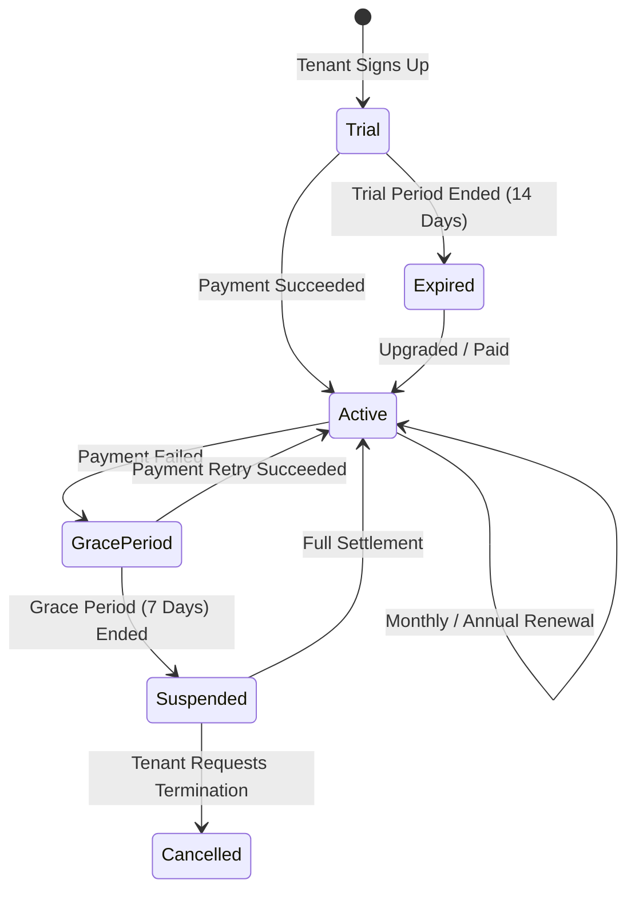

# 06. Subscription & Entitlement Engine

## 1. Subscription & Plan Architecture

The SaaS monetization engine is managed by Super Admin and enforces real-time usage quotas and feature access rules for every subscriber.

```
Plan (e.g., Professional Tier)
  ├── PlanEntitlements (Feature: "pharma.batch_tracking" = Enabled)
  └── PlanUsageLimits
        ├── MaxUsers: 10
        ├── MaxBranches: 3
        ├── MaxWarehouses: 5
        ├── MaxInvoicesPerMonth: 5000
        └── MaxStorageMb: 5120
```

---

## 2. Dynamic Entitlement Enforcement

1. **Feature-Level Entitlement**:
   - Evaluated during API request routing and UI component rendering.
   - Example: If Tenant on *Basic Plan* attempts to access `Sales/BatchTracking`, the system responds with `403 FeatureNotEntitled`.
2. **Quota / Limit Enforcement**:
   - Evaluated on resource creation (e.g., adding a new user, branch, or generating an invoice).
   - If `CurrentCount >= MaxLimit`, creation is blocked with a structured upgrade suggestion payload.
3. **Add-Ons & Overrides**:
   - Tenants can purchase standalone Add-Ons (e.g., "+5 Users", "+10,000 Invoices/month", "E-Invoicing API Connector") that dynamically augment the plan limits.

---

## 3. Subscription Lifecycle State Machine


