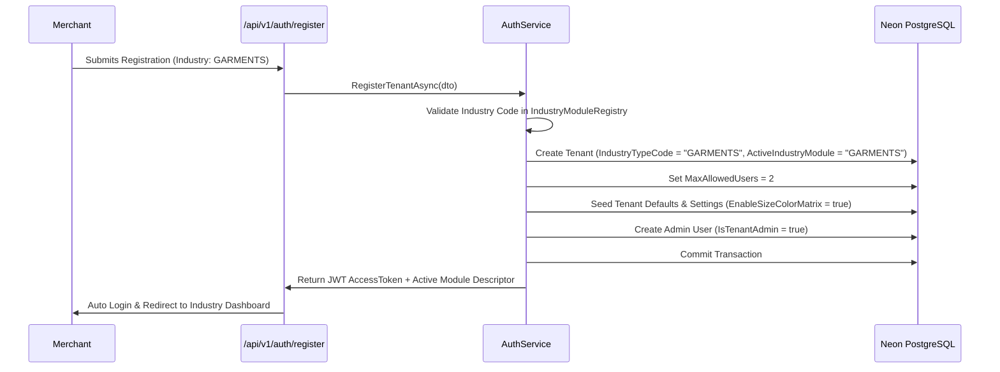

# UdyogBill — Tenant Registration & Industry Activation Flow

## Registration User Experience

To guarantee minimal friction, the registration UI presents a clean, intuitive industry selection step:
1. **Business Details**: Legal Name, Owner Full Name, Mobile, Email, Password, City, State, GSTIN (optional).
2. **Business Industry Selection**: Customer picks from the 7 canonical industries:
   - 💊 Pharma & Chemist
   - 🛒 FMCG & Supermarket
   - 📱 Electronics & Mobile Retail
   - 👔 Garments & Apparel
   - 🔧 Hardware & Electricals
   - 💼 Service Sector & Consulting
   - 🌐 General Trading & Retail
3. **No Pricing Disruption**: The customer does **not** see module prices or upsells during registration. The core plan includes their chosen industry pack automatically.

---

## Server-Side Lifecycle (`AuthService.RegisterTenantAsync`)

When the registration form posts to `POST /api/v1/auth/register`:

### Server Implementation Highlights
1. **Industry Code Sanitization**: The submitted code is validated against `IndustryModuleRegistry.CanonicalIndustries`. If unrecognized, it safely defaults to `OTHER`.
2. **Tenant Provisioning**: The tenant record is saved with:
   - `IndustryTypeCode = chosenCode`
   - `ActiveIndustryModule = chosenCode`
   - `IndustryModuleStatus = 1 (Active)`
   - `IndustryActivatedAtUtc = DateTimeOffset.UtcNow`
   - `MaxAllowedUsers = 2` (core baseline)
3. **Automated Setting Alignment**:
   - For `PHARMA`: `EnableBatchTracking = true`, `EnableExpiryTracking = true`, `DrugLicenseNumber` prompt active.
   - For `GARMENTS`: `EnableSizeColorMatrix = true`, `HangTagPrinting = true`.
   - For `ELECTRONICS`: `EnableSerialTracking = true`, `WarrantyManagement = true`.
   - For `FMCG`: `EnableMultiUnit = true`, `EnableSchemes = true`.

---

## Tenant Isolation Verification

All tenant operations are scoped by `TenantId`:
- Database queries apply global EF Core query filters: `e => e.TenantId == _tenantContext.TenantId`.
- Endpoints check `ITenantModuleAuthorizationService.ValidateModuleAccessAsync(requiredIndustry)` before executing industry-specific endpoints.
